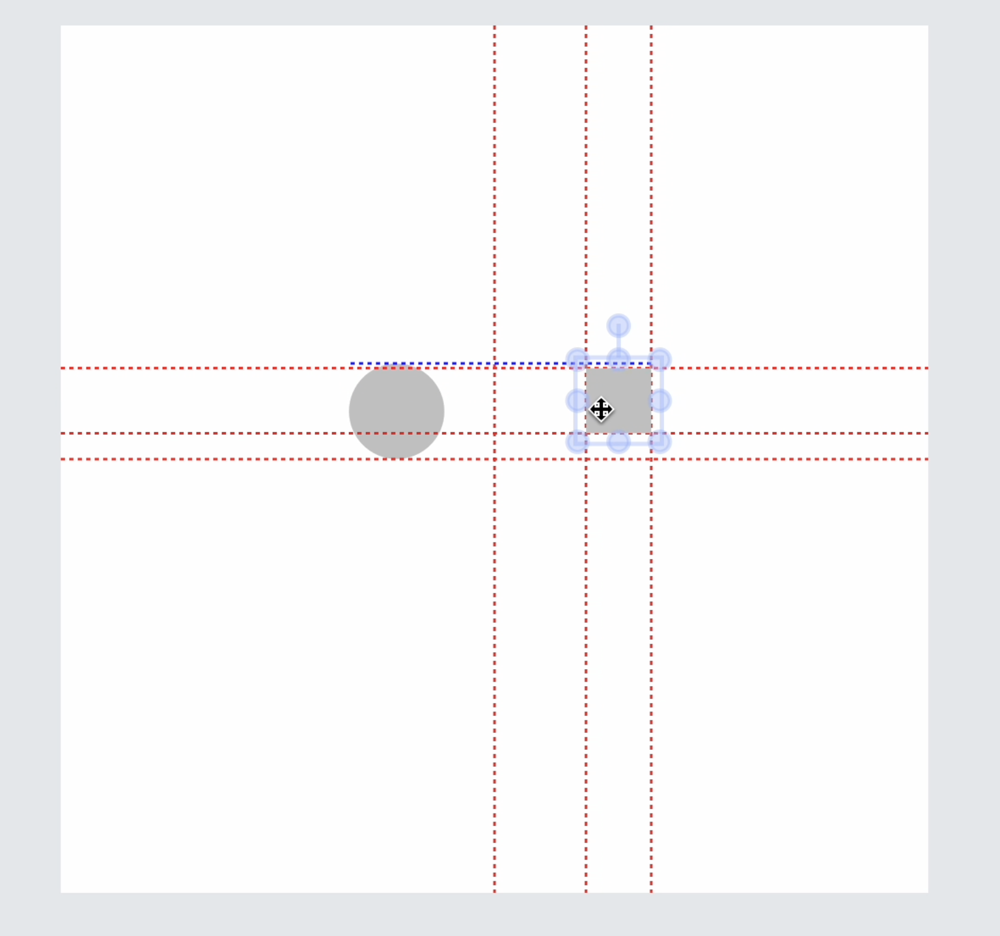

# fabric-v6-guideline

- Help you easily append guidelines to your canvas for the selected objects. It help you easily aligning to your object with the others. And Auto snap when the object moved to the center line of the canvas

## Features

- Easily append guidelines to your fabric.js canvas
- Customize guidelines' style and other options
- Auto snap to the canvas center line
- Zero dependencies



## Quick Start

```shell
npm install fabric-v6-guideline --save
```

After install, you can use it in your project.

```tsx
import { GuideLine } from "fabric-v6-guideline";
```

## Usage

```ts
import { fabric } from "fabric";
import { GuideLine } from "fabric-v6-guideline";

const fabricCanvas = new fabric.Canvas("myCanvas");

const guideline = new GuideLine(fabricCanvas);
guideline.init();
```

You can also set some options to customize the guideline.

```ts
const guideline = new GuideLine(fabricCanvas, {
  lineColor: "#ff4444", // default #ff4444
  lineWidth: 2, // default 1
  canvasCenterLine: false, // default true
  opacity: 0.5, //default 1
  strokeDashArray: [10, 10], // default [5,5]
  snapLineColor: "#ff4444", // default #ff4444
  threshold: 20, // default 20,
  autoSnap: false,
  autoSnapThreshold: 10,
});
```

### Options

- **lineColor**: the alignment line color
- **lineWidth**: the alignment line width
- **canvasCenterLine**: whether to display the canvas center line
- **opacity**: the alignment line opacity
- **strokeDashArray**: the alignment line dash array
- **threshold**: to determine when to display alignment guides as the selected object is being moved near other objects.;
- **autoSnap**: when the selected object moved to canvas center line, it will snap to the center line
- **autoSnapThreshold**: to determine when to snap to the canvas center line.
